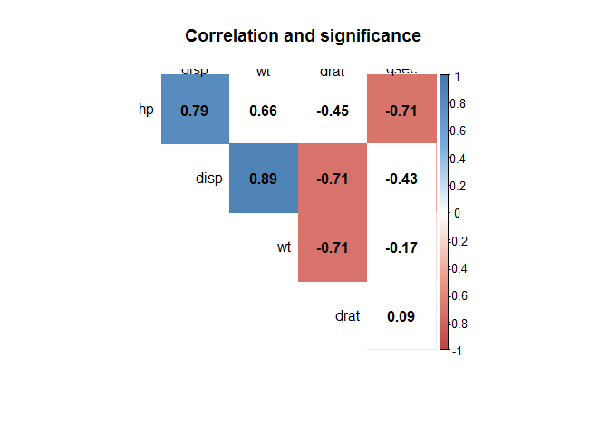
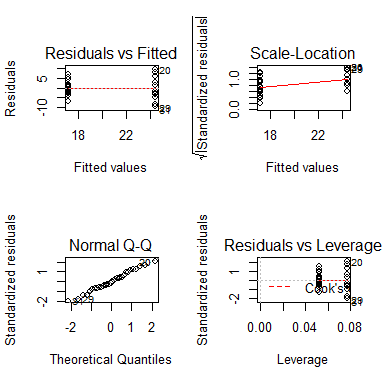
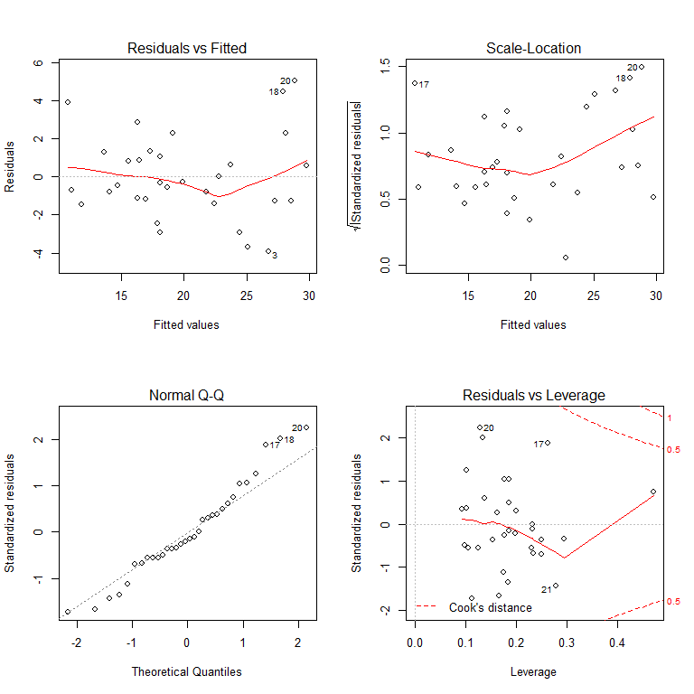

Automatic or Manual transmission?
================
Marcelo Szilagyi
May 20, 2016

Executive Summary
=================

This report, using the mtcars database, addresses the question if the automatic transmission is better than the manual in terms of miles per gallon. An initial Student t-test shows a difference in favor of automated transmission between 3.6 and 10.8 mpg. As transmission can be influenced by other variables, linear regression was used to include relevant variables (e.g.: weight of the car). The final acceptable regression model includes the transmission as a predictor variable, but with p value of 0.2, indicating the transmission is not a predictor of mpg by itself, but only an acceptable predictor when jointly considered with the other variables (weight, number of cylinders and horse power).

(note: document created in Markdown/Knit; most of calculations used "echo=FALSE" to meet 2 page requirement.)

Exploratory data analysis
=========================

Test for transmission impact (t-test)
-------------------------------------

As the question is for a 1 dependent variable and 1 independent variable with 2 levels, the appropriate test is a t test - assuming normality of the population and homoskedasticity (homogeneity of variances). The samples are normal: p values of 0.54 for the automatic transmission group (n= 13) and 0.9 for the manual transmission (n= 19).

The results show that a p value of 2.850207410^{-4}, and the gain in mpgs for automatic cars is in a 95% confidence interval between 3.6 and 10.8 mpgs.

But this is likely irrelevant, as there is other variables that are likely more important to mpg than transmission. The regression approach below will address that.

Correlation between variables
-----------------------------

Before moving into the regression, it is critical to check the correlation between variables to avoid multicollinearity. As the graph below shows, there is strong correlation between most of the continuous variables. Additional analysis (not displayed) shows that categorical variables also are highly related to continuous variables - for example, hp (horse power) is smaller in automatic cars.



Finally, using a fisher test (a more precise test for small values than the Chi-Square), only 3 combinations of categorical variables of 10 were not statistically significant: vs and am; am and carb and gear and carb - so in a sense, all variables are entangled with each other.

Regressions
===========

Simplistic Approach
-------------------

Run a regression purely on the transmission (automatic or manual) seems is a result of the following code:

``` r
WrongFit = lm(mpg ~ am, data=dt)
```

The intercept is 17.15 and the slope is 7.24. This means a car wit manual transmission has an expected mpg of 17.1 mpg while a car with automatic transmission has an expected 24.3 mpg performance. Note the increase in performance matches the Student t test value mentioned above. The appendix shows the residual plots of this regression and the residuals not fitted - and that's the reason why the R-squared is only 0.35 (ie, only 35% of the variation can be explained by the variable).

Stepwise Approach
-----------------

As the figure above shows, there is a significant correlation between the variables. So, there is a need to apply a regression method that includes or excludes variables considering the benefit to the regression. A stepwise approach was adopted in both directions, based on F statistic:

    ## 
    ## Call:
    ## lm(formula = mpg ~ cyl + hp + wt + am, data = dt)
    ## 
    ## Residuals:
    ##     Min      1Q  Median      3Q     Max 
    ## -3.9387 -1.2560 -0.4013  1.1253  5.0513 
    ## 
    ## Coefficients:
    ##             Estimate Std. Error t value Pr(>|t|)    
    ## (Intercept) 33.70832    2.60489  12.940 7.73e-13 ***
    ## cyl6        -3.03134    1.40728  -2.154  0.04068 *  
    ## cyl8        -2.16368    2.28425  -0.947  0.35225    
    ## hp          -0.03211    0.01369  -2.345  0.02693 *  
    ## wt          -2.49683    0.88559  -2.819  0.00908 ** 
    ## am1          1.80921    1.39630   1.296  0.20646    
    ## ---
    ## Signif. codes:  0 '***' 0.001 '**' 0.01 '*' 0.05 '.' 0.1 ' ' 1
    ## 
    ## Residual standard error: 2.41 on 26 degrees of freedom
    ## Multiple R-squared:  0.8659, Adjusted R-squared:  0.8401 
    ## F-statistic: 33.57 on 5 and 26 DF,  p-value: 1.506e-10

Therefore, as the result above shows, the impact of automatic transmission is to increase between -1.06 and -1.06, all other variables held constant. Therefore, the transmission presents an impact that contributes to a better prediction (jointly with other predictors), but is not a significant by itself impact on the car efficiency. The residuals analsysis (see appendix) did not indicate issues with the residuals. Finally, the VIFs are borderline, but still within the acceptable limits.

Nested likehood approach
------------------------

It is possible to select the variables using the nested likehood ratio tests. Numerous interactions (based on the correlation ratios above) were tested. A solution with 2 variables only - weight and horse power (2nd line on the table below) seems to be the best solution with this approach. Note the 3rd line result is for the model determined in the stepwise solution - note that this model would not be selected using the nested approach, as the p value is 0.08. As a final comment, the adjusted R square of the below model is 0.81, while the more complex model above is 0.84 - a very small difference that might justify the use of the model below - composed by weight and horse power only.

|  Res.Df|       RSS|   Df|  Sum of Sq|         F|  Pr(&gt;F)|
|-------:|---------:|----:|----------:|---------:|----------:|
|      30|  278.3219|   NA|         NA|        NA|         NA|
|      29|  195.0478|    1|   83.27418|  14.33617|  0.0008142|
|      26|  151.0256|    3|   44.02216|   2.52623|  0.0794665|

Appendix
========

Residual plot for the simplistic/wrong regression
=================================================



Residual Diagnostics for the final regression
=============================================

``` r
fit = OptimizedFit
outlierTest(fit)
```

    ## No Studentized residuals with Bonferonni p < 0.05
    ## Largest |rstudent|:
    ##    rstudent unadjusted p-value Bonferonni p
    ## 20  2.45057           0.021604      0.69131

``` r
#qqPlot(fit, main="QQ Plot") #qq plot for studentized resid 
#leveragePlots(fit) # leverage plots
layout(matrix(c(1,2,3,4),2,2)) # optional 4 graphs/page 
plot(fit)
```



``` r
layout(matrix(c(1,1,1,1),1,1))
```

VIF

``` r
knitr::kable(vif(fit))
```

|     |      GVIF|   Df|  GVIF^(1/(2\*Df))|
|-----|---------:|----:|-----------------:|
| cyl |  5.824545|    2|          1.553515|
| hp  |  4.703625|    1|          2.168784|
| wt  |  4.007113|    1|          2.001778|
| am  |  2.590777|    1|          1.609589|

Criteria

References <http://rmarkdown.rstudio.com>

<http://www.statmethods.net/stats/regression.html>

<http://www.ats.ucla.edu/stat/stata/whatstat/>

<http://stats.stackexchange.com/questions/66448/should-covariates-that-are-not-statistically-significant-be-kept-in-when-creat>
